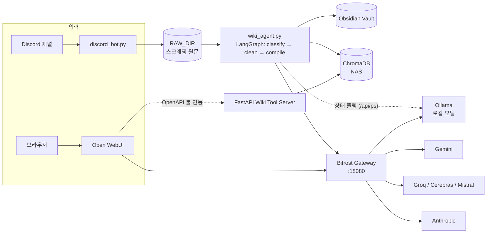
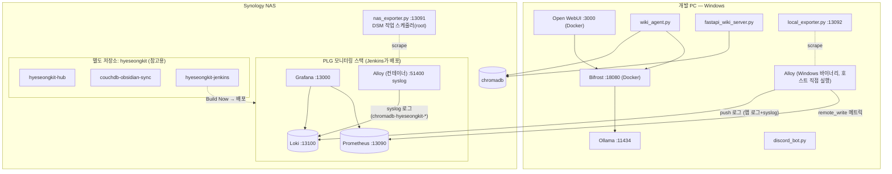
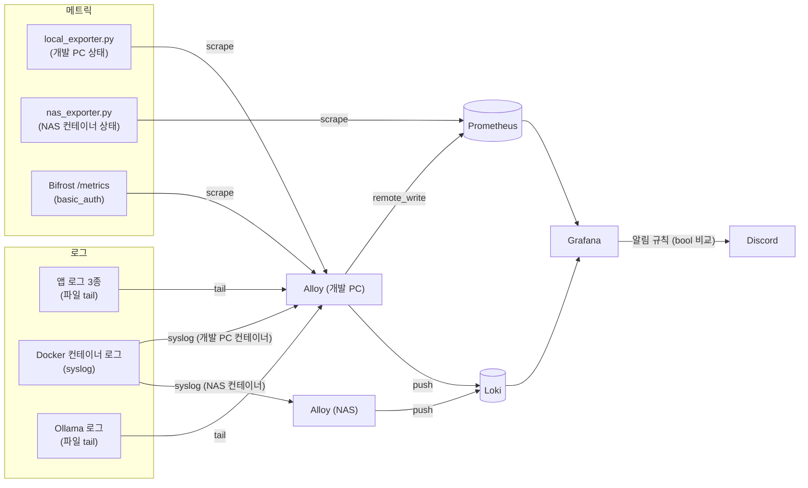
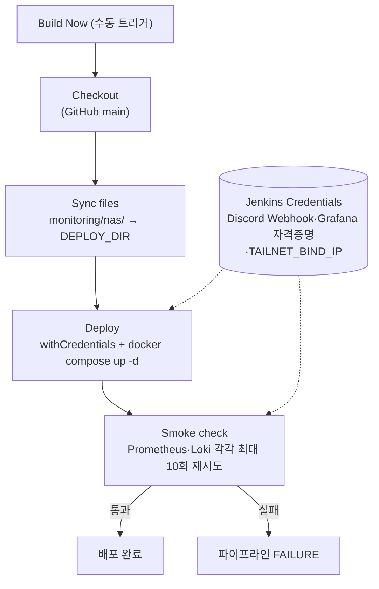
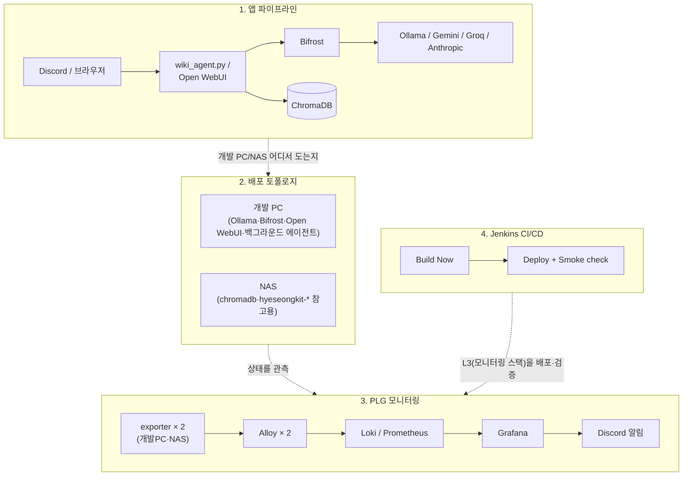

# Local LLM System Architecture

이 문서는 로컬 LLM 구동(Ollama + Bifrost + Open WebUI), Obsidian 지식 관리 자동화(Wiki Agent),
그리고 이를 관측하는 PLG 모니터링 스택까지 — 전체 시스템의 상세 아키텍처를 정리한 문서입니다.
빠른 개요·설치 방법은 [루트 README](../README.md)를 먼저 보세요.

## 💻 하드웨어 환경 (Hardware Specifications)
- **OS:** Windows 10 Home 64-bit
- **CPU:** AMD Ryzen 5 5600X 6-Core Processor (3.70 GHz)
- **RAM:** 32.0 GB
- **GPU:** AMD Radeon RX 6600 XT (8 GB VRAM)

---

## 🏗️ 시스템 구성 개요

시스템은 네 개의 층으로 나눠서 본다. 아래 순서대로 읽으면 "무엇을 처리하는지 → 어디서 도는지 →
어떻게 관측하는지 → 어떻게 배포하는지"로 이어진다.

1. **앱 파이프라인** — Discord/Open WebUI 입력이 Wiki Agent·ChromaDB·LLM 게이트웨이를 거치는 흐름
2. **배포 토폴로지** — 무엇이 개발 PC(Windows)에서, 무엇이 NAS(Synology)에서 도는지
3. **PLG 모니터링 데이터 흐름** — Alloy/Loki/Prometheus/Grafana가 양쪽을 어떻게 관측하는지
4. **Jenkins CI/CD** — 모니터링 스택 자체를 어떻게 배포·검증하는지

각 층의 설계 배경과 실측 근거는 [`plg_monitoring_design.md`](plg_monitoring_design.md),
사고·교훈은 [`troubleshooting.md`](troubleshooting.md)에 자세히 남아 있다. 이 문서는 "지금 구조가
어떻게 생겼는지"만 보여준다.

---

### 1. 앱 파이프라인



- **Bifrost**: Ollama(로컬)/Gemini/Groq/Cerebras/Mistral/Anthropic을 하나의 게이트웨이 뒤로 통합. Langfuse로 OTel 트레이싱 연동. Open WebUI는 `ENABLE_OLLAMA_API=false`로 Ollama 직접 호출을 끄고 전부 이 게이트웨이를 통과시킨다.
- **wiki_agent.py**: 메인 LLM 호출(분류·정제·컴파일)은 Bifrost를 거치지만, VRAM/모델 적재 상태 확인(`/api/ps`)만은 Ollama에 직접 요청한다.
- **ChromaDB**: NAS 컨테이너로 구동 — 개발 PC의 Docker Desktop이 아니다. 접속은 `src/chroma_client.py`의 `get_chroma_client()`로 일원화.
- **FastAPI Wiki Tool Server**: Open WebUI와 표준 OpenAPI로 연동되는 위키 검색 툴 서버.

---

### 2. 배포 토폴로지 — 개발 PC ↔ NAS



- 개발 PC의 백그라운드 프로세스(`wiki_agent.py`·`discord_bot.py`·`fastapi_wiki_server.py`·`local_exporter.py`)는 전부 `pythonw.exe`로 콘솔 없이 실행된다 — 실행 흐름은 아래 [부팅 및 실행 흐름](#-부팅-및-실행-흐름-startup-sequence) 참고.
- **NAS 컨테이너 로그**는 전부 `syslog` 드라이버로 Alloy(NAS)에 dual-logging(= `docker logs`도 유지)된다.
- `hyeseongkit-hub`·`couchdb-obsidian-sync`·`hyeseongkit-jenkins`는 이 저장소(`local_LLM`)가 아니라 **별도 저장소 `hyeseongkit`** 소속이다. 이 저장소의 모니터링 exporter가 상태를 관측만 할 뿐, 배포·코드는 여기서 관리하지 않는다.

---

### 3. PLG 모니터링 데이터 흐름



- **보존:** 로그 30일 · 메트릭 90일.
- **노출면:** Grafana(13000)만 tailnet에 열려 있고, Loki·Prometheus·exporter·syslog 수신기는 전부 루프백 전용.
- **알림 원칙:** PromQL 필터식은 조건 미충족 시 빈 결과를 내고, Grafana는 빈 결과를 기본적으로 NoData로 취급해 오탐을 낸다 — 그래서 알림 조건은 `bool` 비교로 항상 값이 존재하게 짠다(실측 근거는 `troubleshooting.md` 섹션 18 증상 4).
- 설계 배경·포트·보존 정책 전체는 [`plg_monitoring_design.md`](plg_monitoring_design.md) 참고.

---

### 4. Jenkins CI/CD — 모니터링 스택 배포



- **배포는 이 파이프라인이 유일한 경로다.** NAS 배포 디렉터리(`/volume1/docker/ci-deploys/monitoring-nas`)에는 `.env` 파일이 없다 — 값은 전부 Jenkins Credentials에서 주입되고, 사람이 직접 `docker compose up -d`를 돌리면 `:?` 가드에 막혀 반드시 실패한다(의도된 동작).
- `Deploy`·`Smoke check` 두 스테이지가 같은 `withCredentials` 바인딩을 재사용한다 — 그렇지 않으면 조회만 하는 `docker compose ps`조차 `${VAR}` 보간 실패로 죽는다(`troubleshooting.md` 섹션 18 증상 8).
- Smoke check은 컨테이너가 `Up` 상태여도 서비스가 그 순간 응답 가능하다는 보장이 없어 재시도 루프로 짰다(증상 10). 정의는 [`Jenkinsfile`](../monitoring/nas/Jenkinsfile).

---

### 전체 통합 구성도



---

## 🚀 부팅 및 실행 흐름 (Startup Sequence)

윈도우 부팅 시, **저장소가 아니라 Windows 시작 프로그램 폴더**(`%USERPROFILE%\AppData\Roaming\Microsoft\Windows\Start Menu\Programs\Startup\ai-server-start.bat`)에 등록된 스크립트가 아래 순서로 시스템을 조용히 구성한다.

1. **환경 변수 주입**: `HSA_OVERRIDE_GFX_VERSION=10.3.0`(AMD GPU 가속), `OLLAMA_HOST=0.0.0.0`, `OLLAMA_NUM_THREADS=6`, `OLLAMA_MAX_LOADED_MODELS=2`. `OLLAMA_DEBUG`는 기본 꺼둠 — 디버그 로깅은 로테이션이 없어 디스크 위험이라, 문제를 파고들 때만 켠다(`plg_monitoring_design.md` 6-4).
2. **좀비 프로세스 정리**: 기존 `ollama.exe` / `llama-server.exe` 강제 종료.
3. **Docker Desktop 구동**: 엔진이 완전히 올라올 때까지 대기.
4. **Ollama 백그라운드 실행**: `powershell`로 숨김 상태 `ollama serve`. stdout/stderr을 재기동 시각 기반 파일명(`logs/ollama-<STAMP>.log`)으로 리다이렉트 — 같은 이름으로 재생성하면 Alloy의 Windows 로테이션 결함(alloy#2292)에 걸려 수집이 멈추기 때문.
5. **Bifrost 게이트웨이 실행**: `bifrost/start_bifrost.py`.
6. **FastAPI 툴 서버 실행**: `pythonw.exe src/tools/fastapi_wiki_server.py`.
7. **Wiki Agent 실행**: `pythonw.exe src/agent/wiki_agent.py`.
8. **Discord Bot 실행**: `pythonw.exe src/agent/discord_bot.py`.
9. **개발 PC 상태 exporter 실행**: `pythonw.exe exporter/local_exporter.py`.
10. **Alloy 실행**: `monitoring/devpc/start-alloy.bat` — 로컬 메트릭을 NAS로 remote-write.

> 저장소 루트의 `restart.bat`은 `shutdown.bat` 실행 후 이 스크립트를 다시 호출한다.

---

## 📂 주요 파일 및 디렉토리 구조

```text
C:\local_LLM\
│
├── .env                        # 모델명, DB 주소, 토큰 등 비밀 환경변수 (커밋 대상 아님)
├── .env.example                 # 위 파일의 키 목록 템플릿
├── restart.bat / shutdown.bat   # 백그라운드 데몬 + Bifrost 컨테이너 재시작/종료
├── bifrost/                     # LLM 게이트웨이 (docker-compose.yml, start_bifrost.py)
├── open-webui/                  # Open WebUI (docker-compose.yml — Bifrost 경유 설정)
├── modelfiles/                  # 확장 컨텍스트 Modelfile (num_ctx 상속 오버라이드)
├── monitoring/
│   ├── devpc/                   # 개발 PC Alloy 설정 (config.alloy, start-alloy.bat)
│   └── nas/                     # NAS PLG 스택 (docker-compose.yml, Jenkinsfile, grafana-provisioning/)
├── exporter/                    # local_exporter.py(개발 PC), nas_exporter.py(NAS 호스트 스크립트)
├── scripts/                     # CI 보조 + 운영 스크립트 (impact_analysis.py, benchmark_bifrost.py,
│                                 #   manage_tasks.ps1, cleanup_logs.ps1, exporter_watchdog.ps1)
├── src/
│   ├── agent/                   # discord_bot.py, wiki_agent.py
│   ├── tools/                   # fastapi_wiki_server.py (Open WebUI 툴 서버)
│   ├── scripts/                 # recreate_db.py, reembed_chroma.py (ChromaDB 유지보수)
│   ├── config.py                # .env 기반 설정 (pydantic-settings)
│   ├── chroma_client.py         # ChromaDB 접속 공통 팩토리
│   ├── embedding_function.py    # 임베딩 함수 팩토리
│   ├── logger_setup.py          # UTF-8 안전 로거 + 날짜 기반 로테이션
│   └── prompts.py                # Wiki Agent 분류/컴파일 프롬프트
├── archive/                     # 폐기된 이전 구현체 (참고용)
├── .github/workflows/            # pipeline.yml(secret-scan/lint/codeql/impact-analysis),
│                                 #   benchmark.yml(성능 벤치마크)
└── Docs/                        # 이 문서, troubleshooting.md, plg_monitoring_design.md 등
```

---

## 🛠️ 유지보수 및 팁

* **모델 파라미터**: 기본은 클라이언트(Open WebUI/API 요청) 측에서 온도·top_k 등을 유연하게 주입한다. 다만 **게이트웨이(Bifrost)가 `num_ctx`는 전달하지 못해서**, 컨텍스트 상한만은 `modelfiles/`의 Modelfile로 모델 자체에 내장해 둔다(`FROM`이 원본의 다른 파라미터를 그대로 상속하므로 `num_ctx`만 적으면 된다) — 자세한 근거는 [`modelfiles/README.md`](../modelfiles/README.md), [`context_limit_experiment.md`](context_limit_experiment.md).
* **프로세스 확인**: 작업 관리자 세부 정보 탭에서 `ollama.exe`·`pythonw.exe`(4개: wiki_agent, discord_bot, fastapi_wiki_server, local_exporter)·`alloy.exe` 확인. 또는 Grafana `agent_process_count` 패널(정상값 2 — 런처+인터프리터).
* **재시작/정리**: 수정 사항 적용이나 좀비 프로세스 정리는 `shutdown.bat` → `restart.bat` 순으로.
* **모니터링 배포**: NAS 쪽 배포·설정 변경은 사람이 직접 하지 않는다 — Jenkins job의 **Build Now**로만 한다(위 4장 참고).
