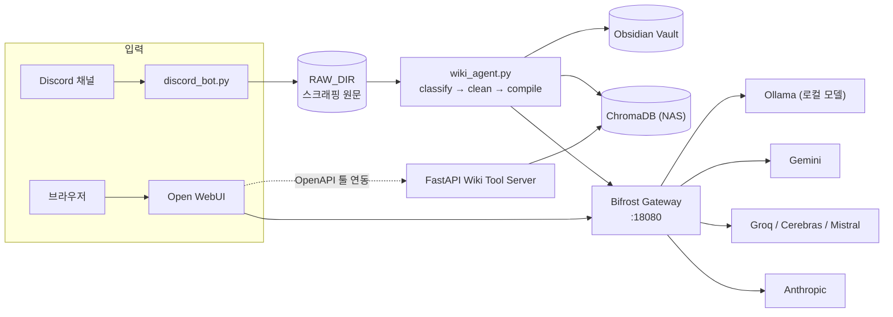

# Local LLM Stack

Windows 데스크톱(AMD RX 6600 XT, 8GB VRAM)에서 로컬 LLM을 자체 운영하며,
Obsidian 지식 관리와 Discord 자동화를 결합한 개인용 AI 인프라 프로젝트입니다.
외부 API 의존을 최소화하되, 로컬 모델의 한계(긴 컨텍스트, 멀티파일 리팩토링 등)는
Bifrost 게이트웨이를 통해 클라우드 API로 폴백합니다. 개발 PC와 NAS에 걸친 배포 상태는
자체 구축한 PLG(Alloy/Loki/Prometheus/Grafana) 스택으로 관측합니다.

## 아키텍처



- **Bifrost**: Ollama(로컬)/Gemini/Groq/Cerebras/Mistral/Anthropic을 하나의 게이트웨이 뒤로 통합. Langfuse로 OTel 트레이싱 연동.
- **Ollama**: 로컬 LLM 런타임 (Vulkan 백엔드로 AMD GPU 가속)
- **Wiki Agent**: LangGraph 기반 파이프라인(classify → clean → compile)으로 스크래핑 원문을 Obsidian 위키 문서로 자동 컴파일, ChromaDB에 RAG 인덱싱
- **Discord Bot**: 지정 채널의 URL/메시지를 비동기로 스크래핑해 원문 저장
- **FastAPI Wiki Tool Server**: Open WebUI와 표준 OpenAPI로 연동되는 위키 검색 툴 서버

> 개발 PC ↔ NAS 배포 토폴로지, PLG 모니터링 데이터 흐름, Jenkins CI/CD까지 포함한
> 전체 상세 구성도는 [`Docs/README.md`](Docs/README.md)에 있습니다.

## 모델 라인업 (Bifrost 기준)

Bifrost가 `num_ctx`를 전달하지 못해, 컨텍스트를 늘려 쓰는 모델은 `modelfiles/`의 Modelfile로
상한을 모델 자체에 내장해 뒀습니다(원본의 다른 파라미터는 그대로 상속). 실제로 호출하는 건
아래 "실사용 모델" 쪽입니다 — 근거는 [`modelfiles/README.md`](modelfiles/README.md).

| 역할 | 실사용 모델 | num_ctx | 원본 | Provider |
|---|---|---|---|---|
| 기본 대화 | `qwen3.5-16k` | 16,384 | `qwen3.5:9b` | Ollama (로컬) |
| 코딩 | `qwen2.5-coder-16k` | 16,384 | `qwen2.5-coder:7b` | Ollama (로컬) |
| 비전 | `gemma4-e4b-64k` | 65,536 | `gemma4:e4b` | Ollama (로컬) |
| 임베딩 | `bge-m3` | 기본값 | — | Ollama (로컬) |
| RAG 폴백 | `exaone3.5:7.8b` | 기본값 | — | Ollama (로컬) |
| 면접/추론 | `deepseek-r1:14b` | 기본값 | — | Ollama (로컬) |
| 클라우드 폴백 | Gemini 1.5 Pro/Flash, Claude 3.5 Sonnet, Llama3 (Groq/Cerebras), Codestral (Mistral) | — | — | 각 API |

## 레포 구조

```
├── .github/
│   └── workflows/
│       ├── pipeline.yml    # CI: secret-scan/lint/codeql(병렬) → impact-analysis
│       └── benchmark.yml   # 성능 벤치마크 (PR/workflow_dispatch/schedule)
├── bifrost/             # Bifrost 게이트웨이 (docker-compose.yml, start_bifrost.py)
├── open-webui/          # Open WebUI (docker-compose.yml, Bifrost 경유 설정)
├── modelfiles/          # 확장 컨텍스트 Modelfile (num_ctx 상속 오버라이드)
├── monitoring/          # PLG 모니터링 스택 — devpc/(Alloy 설정), nas/(compose+Jenkinsfile)
├── exporter/            # local_exporter.py(개발 PC), nas_exporter.py(NAS 호스트 스크립트)
├── src/
│   ├── agent/           # discord_bot.py, wiki_agent.py
│   ├── tools/            # fastapi_wiki_server.py (Open WebUI 툴 서버)
│   ├── scripts/          # recreate_db.py, reembed_chroma.py (ChromaDB 유지보수)
│   ├── config.py         # .env 기반 설정 (pydantic-settings)
│   ├── chroma_client.py  # ChromaDB 접속 공통 팩토리
│   ├── logger_setup.py   # UTF-8 안전 로거 + 날짜 기반 로테이션
│   └── prompts.py        # Wiki Agent 분류/컴파일 프롬프트
├── scripts/              # CI 보조 + 운영 스크립트 (impact_analysis.py, benchmark_bifrost.py,
│                         #   manage_tasks.ps1, cleanup_logs.ps1, exporter_watchdog.ps1)
├── archive/              # 폐기된 이전 구현체 (참고용)
├── Docs/                 # 아키텍처, 튜닝 가이드, 트러블슈팅 로그, 모니터링 설계
├── requirements.txt / pyproject.toml  # 의존성 명세 및 ruff lint 설정
└── restart.bat / shutdown.bat  # 백그라운드 프로세스 및 Docker 컨테이너 재시작/종료
```

## 설치 및 실행

### 사전 요구사항
- [Ollama](https://ollama.com/download)
- [Docker Desktop](https://www.docker.com/products/docker-desktop)
- Python 3.11+
- [Tailscale](https://tailscale.com/download) (외부 접속 시)

### 설정
```powershell
cp .env.example .env
# .env에 VAULT_PATH, CHROMA_HOST/PORT, DISCORD_BOT_TOKEN, BIFROST_*, 각 API 키 등을 채워 넣습니다.
```

### 확장 컨텍스트 모델 생성 (최초 1회)
```powershell
ollama create qwen3.5-16k        -f modelfiles/qwen3.5-16k.Modelfile
ollama create qwen2.5-coder-16k  -f modelfiles/qwen2.5-coder-16k.Modelfile
ollama create gemma4-e4b-64k     -f modelfiles/gemma4-e4b-64k.Modelfile
```

### Bifrost 게이트웨이 / Open WebUI 시작
```powershell
python bifrost/start_bifrost.py
docker compose --env-file .env -f open-webui/docker-compose.yml up -d
```

### 위키 에이전트 / Discord 봇 / 툴 서버 실행
```powershell
python src/agent/wiki_agent.py
python src/agent/discord_bot.py
python src/tools/fastapi_wiki_server.py
```

### 전체 스택 재시작/종료
```powershell
.\restart.bat
.\shutdown.bat
```
자동 배포는 없습니다 — `main`이 바뀌면(예: 다른 기기에서 머지) `git pull` 후 위 `restart.bat`을 직접 실행해 반영하세요.

### 모니터링 스택 (NAS)
NAS 쪽 PLG 모니터링 스택은 이 저장소에서 직접 배포하지 않습니다 — **Jenkins job의 Build Now**로만 배포합니다. 자세한 내용은 [`Docs/README.md`](Docs/README.md) 3~4장, [`Docs/plg_monitoring_design.md`](Docs/plg_monitoring_design.md) 참고.

## 더 자세한 내용

- [`Docs/README.md`](Docs/README.md) — 전체 시스템 구성도 상세 설명 (앱 파이프라인/배포 토폴로지/모니터링/CI)
- [`Docs/plg_monitoring_design.md`](Docs/plg_monitoring_design.md) — PLG 모니터링 스택 설계·구축 기록
- [`modelfiles/README.md`](modelfiles/README.md) — 확장 컨텍스트 Modelfile 가이드
- [`Docs/model_tuning.md`](Docs/model_tuning.md) — 모델별 파라미터 튜닝 가이드
- [`Docs/llm_webui_config.md`](Docs/llm_webui_config.md) — Open WebUI 커스텀 설정 가이드
- [`Docs/troubleshooting.md`](Docs/troubleshooting.md) — 운영 중 발생한 에러/해결 로그
- [`Docs/implementation_plan.md`](Docs/implementation_plan.md) — 확장 로드맵
- [`Docs/persona_prompts_reference.md`](Docs/persona_prompts_reference.md) — 이전 버전 페르소나 프롬프트 아카이브
